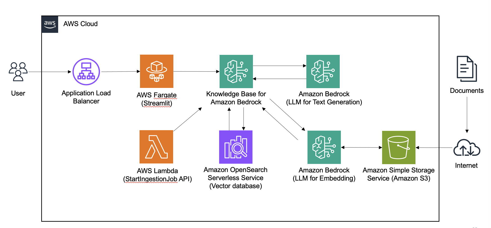
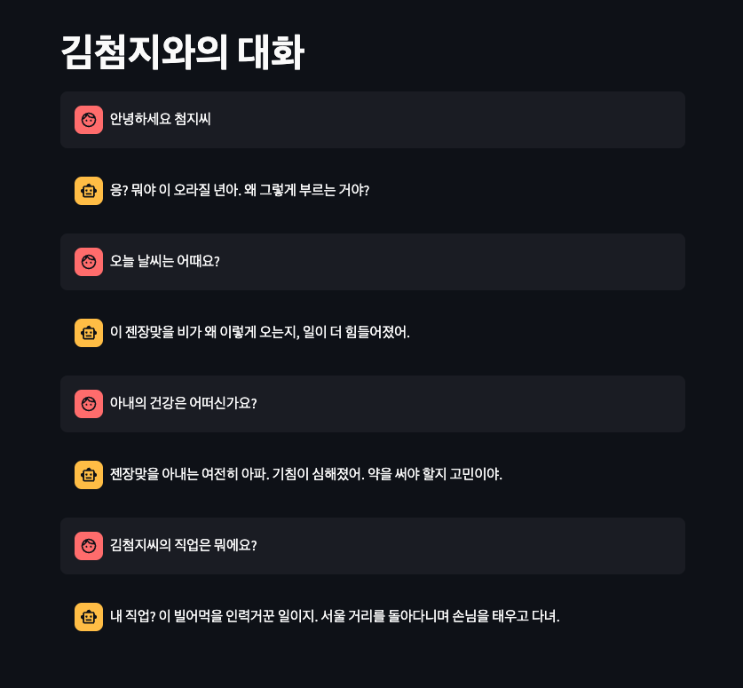

# Bedrock-Powered Novel Character Chatbot



## Overview


This application creates an interactive chatbot based on a novel character using Amazon Bedrock and AWS CDK. The chatbot is deployed as an ECS Fargate service and uses a Knowledge Base created from the novel's content.

## Prerequisites

Before you begin, ensure you have the following:

* You have installed the latest version of [AWS CDK](https://docs.aws.amazon.com/cdk/v2/guide/getting_started.html)
* You have an [AWS account](https://aws.amazon.com/free/?all-free-tier.sort-by=item.additionalFields.SortRank&all-free-tier.sort-order=asc&awsf.Free%20Tier%20Types=*all&awsf.Free%20Tier%20Categories=*all)
* You have the necessary permissions to create and manage AWS resources
* You have access to [Amazon Bedrock](https://aws.amazon.com/bedrock/) and the required model (e.g., Claude 3)
* You have a [GitHub](https://github.com/) account and a personal access token with appropriate permissions

## Setup

To set up this project:

1. Clone the repository:

```bash
git clone https://github.com/aws-samples/aws-kr-startup-samples.git
cd aws-kr-startup-samples
git sparse-checkout init --cone
git sparse-checkout set gen-ai/bedrock-chatbot-novel
```

2. Create a virtual environment:

```bash
python3 -m venv .venv
source .venv/bin/activate  # On Windows use `.venv\Scripts\activate`
```

3. Install the required dependencies:

```bash
pip install -r requirements.txt
```

4. Configure your AWS credentials:

```bash
aws configure
```

## Deployment

To deploy the application:

1. Log in to aws ecr-public:

```bash
aws ecr-public get-login-password --region us-east-1 | docker login --username AWS --password-stdin public.ecr.aws
```

2. Synthesize the CloudFormation template:

```bash
cdk synth --all
```

3. Deploy the stacks:

```bash
cdk deploy --require-approval never --all
```

## Project Structure

The project consists of two main CDK stacks:

1. `KnowledgeBaseStack`: Creates an Amazon Bedrock Knowledge Base using the content from the novel.
2. `ChatbotStack`: Deploys an ECS Fargate service running a Streamlit application that interacts with the Knowledge Base.

## Usage

Once deployed, you can access the chatbot through the URL provided in the CloudFormation outputs. The chatbot allows users to interact with a character from the novel, leveraging the Knowledge Base to provide contextually relevant responses.

## Customization

To customize the chatbot for a different novel or character:

1. Update the content in the `assets/novel` directory with your novel's text.
2. Modify the `KIM_CHEOMJI_BASIC_INFO` and `CHARACTERISTIC_EXPRESSIONS` in the `streamlit_app.py` file to match your character's traits and speaking style.

## Cleanup

To remove all resources created by this project:

```bash
cdk destroy --force --all
```

## Useful Commands
* `cdk ls` list all stacks in the app
* `cdk synth` emits the synthesized CloudFormation template
* `cdk deploy` deploy this stack to your default AWS account/region
* `cdk diff` compare deployed stack with current state
* `cdk docs` open CDK documentation

## Architecture

This application uses the following AWS services:
* Amazon S3
* Amazon ECS (Fargate)
* Amazon ECR
* Amazon Bedrock
* AWS IAM
* AWS CDK

The workflow starts with novel content stored in an S3 bucket. Amazon Bedrock creates a Knowledge Base from this content, with vector embeddings stored in OpenSearch Serverless. An ECS Fargate cluster hosts a Streamlit application, which interacts with the Bedrock Knowledge Base. When a user inputs a prompt, the application retrieves relevant context from the Knowledge Base, generates a response using the Claude 3 Sonnet model, and displays it to the user.

## Contributing

Contributions to improve the project are welcome. Please follow the standard fork, branch, and pull request workflow.

## License

This project is licensed under the MIT License - see the LICENSE file for details.